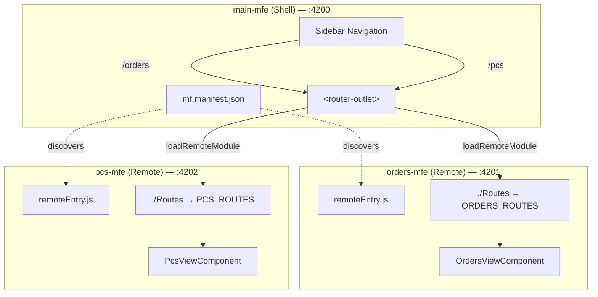
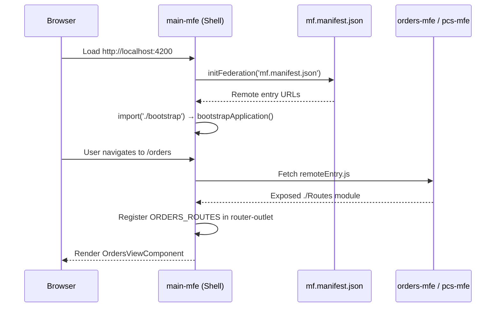
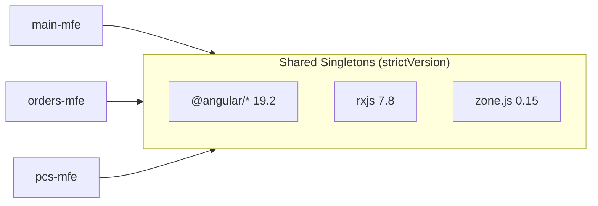

# Angular Module Federation - Micro-Frontend Sample

A micro-frontend architecture built with **Angular 19** and **Webpack Module Federation**, demonstrating how to compose independently deployable Angular applications into a unified shell.

## Architecture Overview



### How It Works

1. **Shell bootstrap** — `main-mfe` initializes Module Federation by loading `mf.manifest.json`, which maps remote names to their `remoteEntry.js` URLs.
2. **Lazy routing** — Angular routes in the shell use `loadRemoteModule()` to fetch remote route definitions on demand.
3. **Shared dependencies** — All apps share Angular, RxJS, and other core libraries as singletons (`shareAll` with `strictVersion: true`), so only one copy of each is loaded at runtime.

### Bootstrap Sequence



### Shared Dependencies



## Project Structure

```
angular-module-federation-mfe-sample/
├── main-mfe/       # Shell (host) application
├── orders-mfe/     # Remote — orders management view
└── pcs-mfe/        # Remote — PC products catalog view
```

Each application is a standalone Angular CLI project with its own `package.json`, `angular.json`, and webpack config.

## Key Files

| File | Purpose |
|------|---------|
| `main-mfe/public/mf.manifest.json` | Maps remote names → `remoteEntry.js` URLs |
| `main-mfe/src/main.ts` | Calls `initFederation()` before bootstrapping |
| `main-mfe/src/app/app.routes.ts` | Defines lazy routes that load remote modules |
| `main-mfe/src/decl.d.ts` | TypeScript declarations for remote modules |
| `orders-mfe/webpack.config.js` | Exposes `./Routes` from orders app |
| `pcs-mfe/webpack.config.js` | Exposes `./Routes` from PCs app |

## Getting Started

### Prerequisites

- Node.js (LTS recommended)
- Angular CLI 19+

### Install Dependencies

```bash
cd main-mfe && npm install
cd ../orders-mfe && npm install
cd ../pcs-mfe && npm install
```

### Run All Applications

Start each app in a separate terminal:

```bash
# Terminal 1 — Shell
cd main-mfe && npm start        # http://localhost:4200

# Terminal 2 — Orders remote
cd orders-mfe && npm start      # http://localhost:4201

# Terminal 3 — PCs remote
cd pcs-mfe && npm start         # http://localhost:4202
```

Open `http://localhost:4200` to see the shell with both remotes loaded.

## Module Federation Configuration

### Remotes (orders-mfe, pcs-mfe)

Each remote declares a `name` and what it `exposes`:

```js
// orders-mfe/webpack.config.js
module.exports = withModuleFederationPlugin({
  name: 'orders-mfe',
  exposes: {
    './Routes': './src/app/orders/orders.routes.ts',
  },
  shared: {
    ...shareAll({ singleton: true, strictVersion: true, requiredVersion: 'auto' }),
  },
});
```

### Shell (main-mfe)

The shell doesn't expose anything — it only consumes remotes via the manifest:

```json
{
  "orders-mfe": "http://localhost:4201/remoteEntry.js",
  "pcs-mfe": "http://localhost:4202/remoteEntry.js"
}
```

Routes load remote modules dynamically:

```ts
{
  path: 'orders',
  loadChildren: () =>
    loadRemoteModule({
      type: 'manifest',
      remoteName: 'orders-mfe',
      exposedModule: './Routes',
    }).then((m) => m.ORDERS_ROUTES),
}
```

## Shared Dependencies Strategy

All applications use `shareAll()` with:

- **`singleton: true`** — one instance of each shared library across all remotes
- **`strictVersion: true`** — version mismatches throw errors instead of silently loading duplicates
- **`requiredVersion: 'auto'`** — reads versions from each app's `package.json`

This requires all apps to use the same Angular and RxJS versions.

## Tech Stack

- Angular 19.2
- TypeScript 5.7
- Webpack Module Federation (`@angular-architects/module-federation` ^19.0.3)
- `ngx-build-plus` for custom webpack config integration
- Karma + Jasmine for testing
